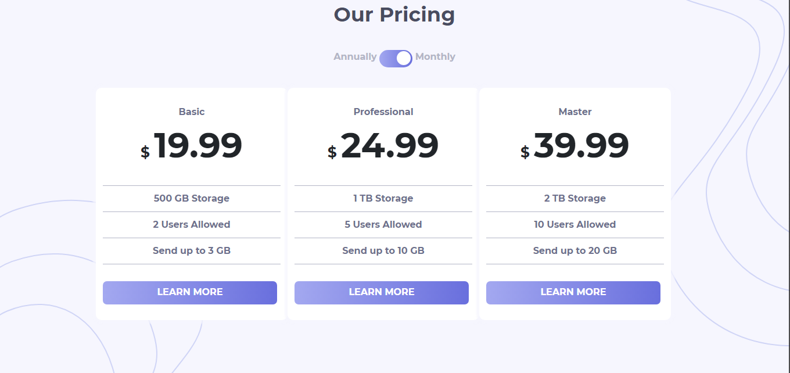

# Frontend Mentor - Pricing component with toggle solution

This is a solution to the [Pricing component with toggle challenge on Frontend Mentor](https://www.frontendmentor.io/challenges/pricing-component-with-toggle-8vPwRMIC). Frontend Mentor challenges help you improve your coding skills by building realistic projects. 

## Table of contents

- [Overview](#overview)
  - [The challenge](#the-challenge)
  - [Screenshot](#screenshot)
  - [Links](#links)
- [My process](#my-process)
  - [Built with](#built-with)
  - [What I learned](#what-i-learned)
  - [Useful resources](#useful-resources)
- [Author](#author)
- [Acknowledgement](#acknowledgement)

## Overview

### The challenge

Users should be able to:

- View the optimal layout for the component depending on their device's screen size
- See the prices of different plans, monthly or annually, with the toogle of a button.

### Screenshot

### Links

- Solution URL: [Add solution URL here](https://your-solution-url.com)
- Live Site URL: [Add live site URL here](https://your-live-site-url.com)

## My process

Initially, I created this project with mobile-first version using Bootstrap and  added the required things from the given information according to the need like changing the price of plans with the click of toogle button. Then, in the desktop version simple css is used to complete the challenge. 

### Built with

- Semantic HTML5 markup
- CSS custom properties
- Mobile-first workflow
- Bootstrap

### Useful resources

- [Bootstrap](https://getbootstrap.com/) - I mostly use this as it enables me to create different things in an easy way.
- [Box Shadow Generator](https://cssgenerator.org/box-shadow-css-generator.html) -  I create Box Shadow using this shadow by just increasing or decreasing the range input and make shadows  according to my wish.

## Author

- Website - [Varun Grover](https://thevarungrovers.vercel.app/)
- Frontend Mentor - [@thevarungrovers](https://www.frontendmentor.io/profile/thevarungrovers)
- Twitter - [@thevarungrovers](https://www.twitter.com/thevarungrovers)

# Acknowledgement

Toogle button - created from [w3school.com](https://w3school.com)